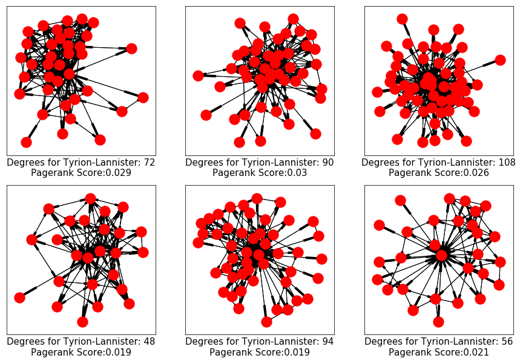

## Organizational Analysis is a Ladder
### Using a graph analysis of Game of Thrones to predict success or death

##### *_Spoilers ahead_*

### Question:
 Is there a "sweet spot" identifiable through graph analysis between having too few and too many connections in an organization, or can a rapid change in number or weight of connections indicate a problem?

### Hypothesis:
 In the Game of Thrones universe, having too rapid a change in the number or closeness of a character's connections will result in that character's untimely demise.

### Methodology:
 Using a network of characters and relationships represented as node-edge graphs, I used a series of centrality measures to determine the relative influence of the most connected characters in Game of Thrones. Connections and weights were determined by how often two characters' names were mentioned within 15 words of one another. (Data was pulled from an existing [github site](github.com/mathbeveridge/asoiaf/tree/master/data))

 

 ###### Of course, this is hard to visualize for 800+ characters, so it is useful to show characters from only one House at a time.

 

 Additionally, the original data did not include group information (in this case the House allegiance of each character) so a web scraper was created to pull house data for each character from the Game of Thrones [wiki site](http://awoiaf.westeros.org/)

 ### Centrality Measures

 | Degree ||Closeness||Betweenness||Eigenvector||Pagerank||
 |---|---|---|---|---|---|---|---|---|---|
 | Tyrion-Lannister|0.30|Tyrion-Lannister|0.47|Jon-Snow|0.19|Tyrion-Lannister|0.25|   Jon-Snow|0.019|
 | Jon-Snow|0.28|Robert-Baratheon|0.45|Tyrion-Lannister|0.16|Cersei-Lannister|0.23|   Tyrion-Lannister|0.018|
 |Jaime-Lannister|0.25|Eddard-Stark|0.45|Daenerys-Targaryen|0.11|Jaime-Lannister|0.22| Jaime-Lannister|0.015|
 |Cersei-Lannister|0.24|Cersei-Lannister|0.45|Theon-Greyjoy|0.11|Joffrey-Baratheon|0.21|Stannis-Baratheon|0.013|
 |Stannis-Baratheon|0.22|Jaime-Lannister|0.45|Stannis-Baratheon|0.11|Sansa-Stark|0.20| Arya-Stark|0.013||

 For the purposes of this analysis, PageRank scoring is used, as an absolute measure of relative influence compared to all other nodes in the network.

 For each character, a plot can be created and the change in centrality and degrees can be shown.

---
 

---

 

 ---

 

 ---

 #### Going forward:
 - Compute the deltas in score across books and create a model to try to predict character death
 - Use NLP and sentiment analysis to pull actual dialogue from the books rather than the 15-words-distance
