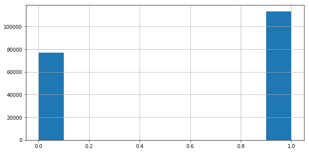
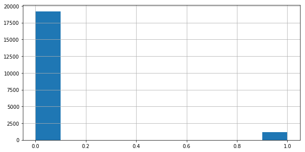

## Classification of cyber attack data based on network traffic characteristics
###### Based on KDDCup 99 dataset

### Intro:
The cyber attack dataset was based on a DARPA experiment in 1998/1999/2000. They set up an approximation of an air force server, and spent a week at a time throwing traffic at it, logging snapshots of network traffic patterns during normal operations and during staged cyberattacks

[Dataset Page](http://kdd.ics.uci.edu/databases/kddcup99/kddcup99.html)

[Original Competition Page](https://www.ll.mit.edu/ideval/docs/index.html
)

### Questions:

Score based on precision; military targets means cost of false negative is high, precision is target score

>Can I predict the name/subtype of an attack?

>Can I predict the category of an attack?

>Can I predict whether observed traffic represents an attack or not?

```
F1 score: 0.994
Precision Score: 0.998
Recall Score: 0.990
ROC_AUC Score: 0.991
```

>>Great, now can I NOT predict it?

### Dataset:
#### Types of attacks:
- Denial of Service
  - Enough connections to overwhelm the server
  - Many short connections
- User to Root
 - Guest or user account used to access privileged or root permissions
 - Single long connection
- Remote to Local
 - Remote host attempts to gain user access
 - Multiple failed connections followed by longer connection(s)
- Probe
 - Remote host attempts to map the local network and/or scan for vulnerabilities
- Secret
 - Allowed user trying to get data out of the network

[Attack descriptions](https://www.ll.mit.edu/ideval/docs/attackDB.html)
#### Protocols
- TCP, UDP, ICMP
 - TCP is a handshake protocol, requires both hosts/servers to communicate bidirectionally
   - Some DOS attacks use many TCP requests or half-finished TCP connections
   - TCP handshakes open longer and/or completed indicate other types of attack

    
 - UDP is a unidirectional connection that doesn't require a server response
   - Less useful to attackers except for specific probing tools, tailored DOS attacks, or attacking one or more particular machines rather than the network as a whole

   
- ICMP is a protocol for hosts to send code responses or errors in response to connection attempts
  - Only useful in one specific variant of DOS, where the attacker pretends to be the victim and sends faulty data to 3rd parties, causing the victim to be inundated with error responses
  - Can be prevented with throttling, may not require active attack modeling
  


#### Derived Features, _not_ raw data
- The dataset used is one step removed from the original classification task
- It turns out, the features I attempted to model on are already derived with the knowledge that an attack was occurring, resulting in **data leakage**
- Should have paid closer attention to the data description:

  > Stolfo et al. defined higher-level features that help in distinguishing normal connections from attacks.

  > Stolfo et al. used domain knowledge to add features that look for suspicious behavior

  > hot = 'number of hot indicators'

- Basically, it turns out I'm modeling on a model


### Modeling
(Such as it is)
#### Cleaning/EDA
3 categorical columns, 38 numerical columns, 23 individual target names (22 attacks and normal traffic)

Classes very imbalanced - 80% attacks, 20% normal traffic on 10% sample dataset

Create 3 dataframes:
- One for the named attack targets
- One for the attack categories
  - Rename elements in target column according to attack category dictionary
- One for whether the traffic is an attack or not
  - Reduce targets to 1 for attack traffic, 0 for normal traffic

#### Pipeline
- Separate categorical data from numerical data
- OneHot encode categorical data using ```pd.get_dummies```
- Standardize numerical data using ```StandardScaler()```
  - Standardization should actually be done after train-test-split, pipeline needs to be reorganized
- ```Concat``` categoricals back onto numericals
- Train-test-split using param ```stratify = y``` to ensure balanced selection between positive and negative classes
- Fit Logistic regression model
  - Logistic regression is a good, general-purpose classifier model
  - using ```l1``` penalty for lasso regression due to large number of features
    - Lasso lassos nearly all features, or 1 or 2, because all are predictive
  - Set ```class_weight = 'balanced'``` to avoid needing to downsample the majority, or upsample the minority class
- **_Panic_**, because ```accuracy, precision, recall, f1, and roc_auc``` scores all return .99+ (this step optional)
```
F1 score: 0.994
Precision Score: 0.998
Recall Score: 0.990
ROC_AUC Score: 0.991
```


### Going forward
- Try classifying on category of attack, then on individual named attacks
  - This is closer to the original intent of the KDDCup99 competition
  - Will likely be a better test of various classifier models
- Try methods for downsampling attack data stratified by attack type
- Create a more robust pipeline
- Unable to accurately test on provided holdout data, as it is unlabeled. Would like to create synthetic holdout set based on SMOTE principles
